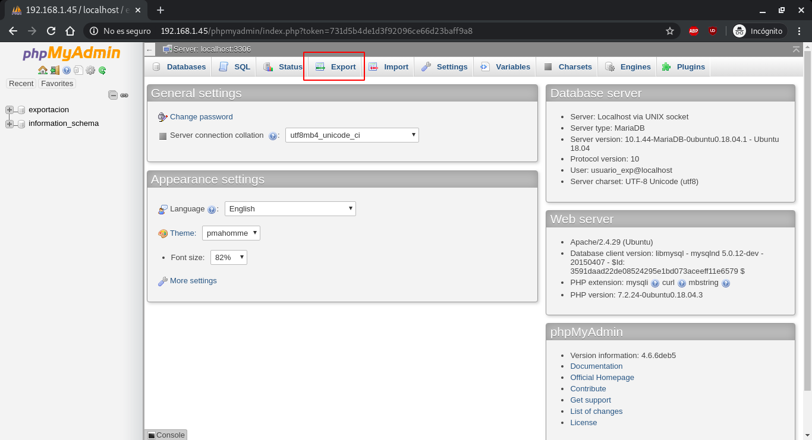
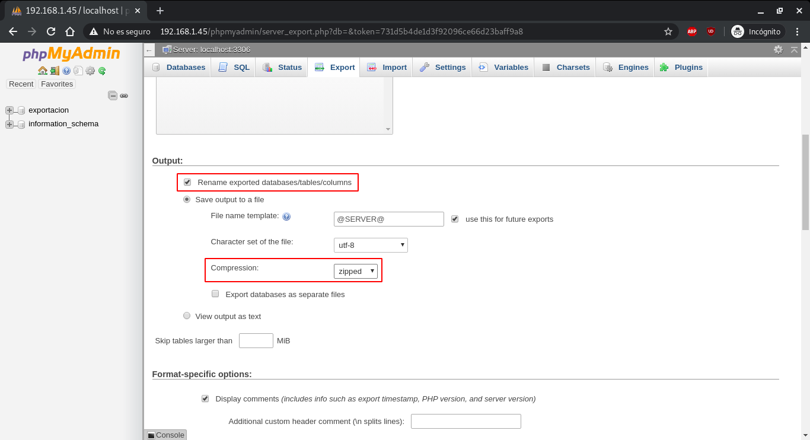
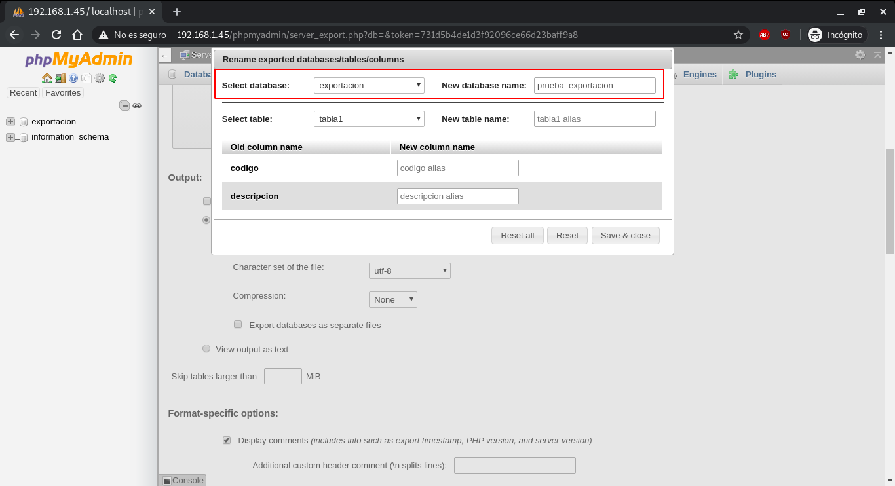
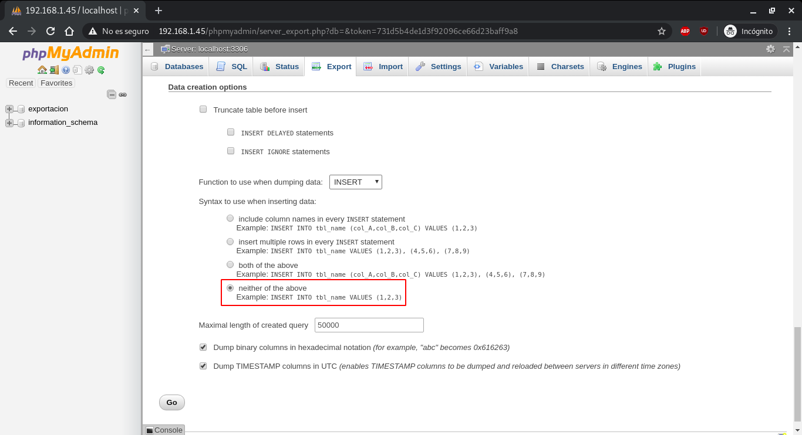
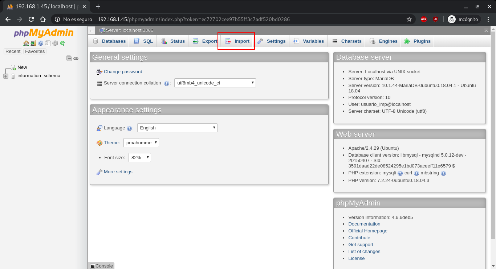
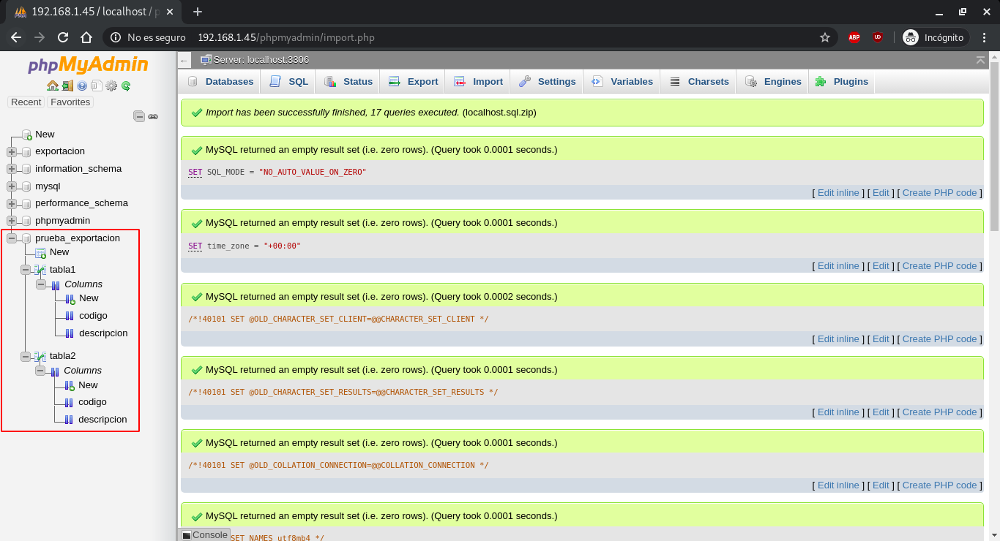

### Tarea 1.
*Realiza una exportación del esquema de SCOTT usando la consola Enterprise Manager, con las siguientes condiciones:*
- *Exporta tanto la estructura de las tablas como los datos de las mismas*.
- *Excluye de la tabla EMP los empleados que no tienen comisión.*
- *Genera un archivo de log en el directorio que consideres más oportuno.*

Antes de comenzar la exportación es necesario crear un directorio a través de `SQL*Plus` donde se guardarán distintos datos así como darle pemisos al usuario encargado de la exportación, es este caso `SCOTT`:
~~~
SQL> CREATE OR REPLACE DIRECTORY directorio_exp AS '/home/oracle/exp_scott/directorio_exp';

Directorio creado.

SQL> GRANT READ, WRITE ON DIRECTORY directorio_exp TO scott;

Concesión terminada correctamente.

SQL> 
~~~

Con esto hecho, crearemos un fichero (`parametros.par`) que contendrá los distintos parámetros que utilizará la exportación:
~~~
# Directorio creado anteriormente.
DIRECTORY=directorio_exp
# Indica el fichero que contendrá la exportación.
DUMPFILE=exp_scott.dmp
# Indica el fichero de log.
LOGFILE=exp_scott.log
# Indica el esquema o esquemas a exportar.
SCHEMAS=scott
# Indica el tipo de dato que contendrá la exportación.
# DATA_ONLY, solo incluye los datos de las tablas.
# METADATA_ONLY solo incluye los metadatos de las tablas.
# ALL incluye ambos.
CONTENT=ALL
# Permite realizar una consulta para filtrar la información que se incluye en la exportación.
# En este caso, excluye a los empleados que no tengan comisión.
QUERY=emp:'"WHERE comm NOT NULL"'
~~~

Una vez especificados todos los parámetros necesarios, comenzamos la exportación:
~~~
oracle@OracleJessie:~/exp_scott$ expdp SCOTT/TIGER@orcl DIRECTORY=directorio_exp DUMPFILE=exp_scott.dmp LOGFILE=exp_scott.log SCHEMAS=scott CONTENT=ALL

Export: Release 12.1.0.2.0 - Production on Vie Mar 6 16:52:46 2020

Copyright (c) 1982, 2014, Oracle and/or its affiliates.  All rights reserved.

Conectado a: Oracle Database 12c Enterprise Edition Release 12.1.0.2.0 - 64bit Production
With the Partitioning, OLAP, Advanced Analytics and Real Application Testing options

Advertencia: las operaciones de Oracle Data Pump no se necesitan normalmente cuando se conecta a la raíz o al elemento inicial de una base de datos del contenedor.

Iniciando "SCOTT"."SYS_EXPORT_SCHEMA_01":  SCOTT/********@orcl DIRECTORY=directorio_exp DUMPFILE=exp_scott.dmp LOGFILE=exp_scott.log SCHEMAS=scott CONTENT=ALL 
Estimación en curso mediante el método BLOCKS...
Procesando el tipo de objeto SCHEMA_EXPORT/TABLE/TABLE_DATA
Estimación total mediante el método BLOCKS: 0 KB
Procesando el tipo de objeto SCHEMA_EXPORT/PRE_SCHEMA/PROCACT_SCHEMA
Procesando el tipo de objeto SCHEMA_EXPORT/TABLE/TABLE
Procesando el tipo de objeto SCHEMA_EXPORT/TABLE/COMMENT
Procesando el tipo de objeto SCHEMA_EXPORT/TABLE/INDEX/INDEX
Procesando el tipo de objeto SCHEMA_EXPORT/TABLE/CONSTRAINT/CONSTRAINT
Procesando el tipo de objeto SCHEMA_EXPORT/TABLE/INDEX/STATISTICS/INDEX_STATISTICS
Procesando el tipo de objeto SCHEMA_EXPORT/TABLE/STATISTICS/TABLE_STATISTICS
Procesando el tipo de objeto SCHEMA_EXPORT/STATISTICS/MARKER
La tabla maestra "SCOTT"."SYS_EXPORT_SCHEMA_01" se ha cargado/descargado correctamente
******************************************************************************
El juego de archivos de volcado para SCOTT.SYS_EXPORT_SCHEMA_01 es:
  /home/oracle/exp_scott/directorio_exp/exp_scott.dmp
El trabajo "SCOTT"."SYS_EXPORT_SCHEMA_01" ha terminado correctamente en Vie Mar 6 16:53:21 2020 elapsed 0 00:00:33

oracle@OracleJessie:~/exp_scott$ 
~~~

### Tarea 4. 
*Intenta realizar operaciones similares de importación y exportación con una herramienta gráfica de administración de MySQL, documentando el proceso.*

Hemos instalado `phpMyAdmin` en una máquina virtual, por lo que accederemos a el a través de la URL `192.168.1.45/phpmyadmin`.
~~~
vagrant@MariaDBServer:~$ ip a
1: lo: <LOOPBACK,UP,LOWER_UP> mtu 65536 qdisc noqueue state UNKNOWN group default qlen 1000
    link/loopback 00:00:00:00:00:00 brd 00:00:00:00:00:00
    inet 127.0.0.1/8 scope host lo
       valid_lft forever preferred_lft forever
    inet6 ::1/128 scope host 
       valid_lft forever preferred_lft forever
2: enp0s3: <BROADCAST,MULTICAST,UP,LOWER_UP> mtu 1500 qdisc fq_codel state UP group default qlen 1000
    link/ether 02:33:ec:f4:7d:44 brd ff:ff:ff:ff:ff:ff
    inet 10.0.2.15/24 brd 10.0.2.255 scope global dynamic enp0s3
       valid_lft 84616sec preferred_lft 84616sec
    inet6 fe80::33:ecff:fef4:7d44/64 scope link 
       valid_lft forever preferred_lft forever
3: enp0s8: <BROADCAST,MULTICAST,UP,LOWER_UP> mtu 1500 qdisc fq_codel state UP group default qlen 1000
    link/ether 08:00:27:4a:81:98 brd ff:ff:ff:ff:ff:ff
    inet 192.168.1.45/24 brd 192.168.1.255 scope global dynamic enp0s8
       valid_lft 41418sec preferred_lft 41418sec
    inet6 fe80::a00:27ff:fe4a:8198/64 scope link 
       valid_lft forever preferred_lft forever
4: enp0s9: <BROADCAST,MULTICAST,UP,LOWER_UP> mtu 1500 qdisc fq_codel state UP group default qlen 1000
    link/ether 08:00:27:0a:01:2e brd ff:ff:ff:ff:ff:ff
    inet 10.0.0.10/24 brd 10.0.0.255 scope global enp0s9
       valid_lft forever preferred_lft forever
    inet6 fe80::a00:27ff:fe0a:12e/64 scope link 
       valid_lft forever preferred_lft forever
vagrant@MariaDBServer:~$ 
~~~

En nuestro caso, vamos a exportar la base de datos `exportacion`, para ello una vez logeados, utilizamos la opción `Export` y pasamos a configurar la exportación:
~~~
# Contenido de la base de datos:
vagrant@MariaDBServer:~$ mysql -u usuario_exp -D exportacion -p
Enter password: 
Reading table information for completion of table and column names
You can turn off this feature to get a quicker startup with -A

Welcome to the MariaDB monitor.  Commands end with ; or \g.
Your MariaDB connection id is 103
Server version: 10.1.44-MariaDB-0ubuntu0.18.04.1 Ubuntu 18.04

Copyright (c) 2000, 2018, Oracle, MariaDB Corporation Ab and others.

Type 'help;' or '\h' for help. Type '\c' to clear the current input statement.

MariaDB [exportacion]> select * from tabla1;
+--------+-------------------+
| codigo | descripcion       |
+--------+-------------------+
|      1 | texto de prueba 1 |
|      2 | texto de prueba 2 |
+--------+-------------------+
2 rows in set (0.00 sec)

MariaDB [exportacion]> select * from tabla2;
+--------+-------------------+
| codigo | descripcion       |
+--------+-------------------+
|      3 | texto de prueba 3 |
|      4 | texto de prueba 4 |
+--------+-------------------+
2 rows in set (0.00 sec)

MariaDB [exportacion]> 

~~~

En el apartado `Output`, cambiaremos el nombre de la base de datos y activaremos la compresión `zip`.

En el apartado `Data creation options`, utilizaremos la opción `neither of the above` para que sea ligeramente más rápido.

Por último, hacemos click en `Go` lo que descargará la exportación.

Una vez exportada, nos logearemos con el usuario `usuario_imp` y utilizaremos la opción `Import`, importamos el archivo y desmarcamos la opción `Allow the interruption of an import in case the script detects it is close to the PHP timeout limit.`.

Como podemos comprobar, la importación se ha realizado correctamente, aunque también haremos la comprobación desde `MariaDB`:

~~~
vagrant@MariaDBServer:~$ mysql -u usuario_imp -D prueba_exportacion -p
Enter password: 
Reading table information for completion of table and column names
You can turn off this feature to get a quicker startup with -A

Welcome to the MariaDB monitor.  Commands end with ; or \g.
Your MariaDB connection id is 102
Server version: 10.1.44-MariaDB-0ubuntu0.18.04.1 Ubuntu 18.04

Copyright (c) 2000, 2018, Oracle, MariaDB Corporation Ab and others.

Type 'help;' or '\h' for help. Type '\c' to clear the current input statement.

MariaDB [prueba_exportacion]> select * from tabla1;
+--------+-------------------+
| codigo | descripcion       |
+--------+-------------------+
|      1 | texto de prueba 1 |
|      2 | texto de prueba 2 |
+--------+-------------------+
2 rows in set (0.00 sec)

MariaDB [prueba_exportacion]> select * from tabla2;
+--------+-------------------+
| codigo | descripcion       |
+--------+-------------------+
|      3 | texto de prueba 3 |
|      4 | texto de prueba 4 |
+--------+-------------------+
2 rows in set (0.00 sec)

MariaDB [prueba_exportacion]> 
~~~