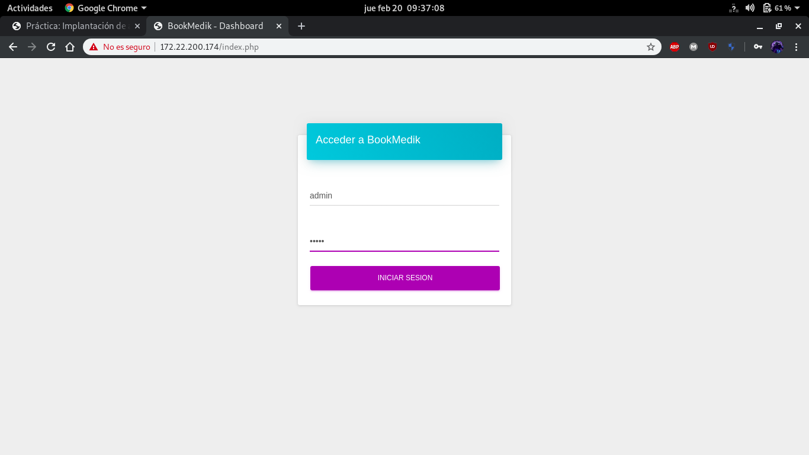

# Docker
### Tarea 1. Ejecución de una aplicación web PHP en Docker.
En esta tarea crearemos dos contenedores (base de datos y aplicación) para ejecutar la aplicación [Bookmedik](https://github.com/evilnapsis/bookmedik) a partir de la imagen de [Debian](https://hub.docker.com/_/debian).

Configuramos `docker-compose` para crear el contenedor de base de datos:
~~~
version: '3.1'

services:
  db:
    container_name: bookmedik_db
    image: mariadb
    restart: always
    environment:
      MYSQL_USER: bookmedik
      MYSQL_PASSWORD: bookmedik
      MYSQL_DATABASE: bookmedik
      MYSQL_ROOT_PASSWORD: root
    volumes:
      - /opt/docker/ej1/db:/var/lib/mysql
~~~

Creamos el contenedor de base de datos y la base de datos de la aplicación:
~~~
root@docker:~/docker/ej1/compose# docker-compose up -d db
Creating bookmedik_db ... done
root@docker:~/docker/ej1/compose#

# Antes de cargar el esquema debemos eliminar la línea "create database bookmedik;" ya que la hemos creado al crear el contenedor.

root@docker:~# cat schema.sql | docker exec -i bookmedik_db /usr/bin/mysql -u root --password=root
root@docker:~# docker exec -it bookmedik_db bash
root@8cea33540cd2:/# mysql -u bookmedik -p bookmedik
Enter password: 
Reading table information for completion of table and column names
You can turn off this feature to get a quicker startup with -A

Welcome to the MariaDB monitor.  Commands end with ; or \g.
Your MariaDB connection id is 10
Server version: 10.4.12-MariaDB-1:10.4.12+maria~bionic mariadb.org binary distribution

Copyright (c) 2000, 2018, Oracle, MariaDB Corporation Ab and others.

Type 'help;' or '\h' for help. Type '\c' to clear the current input statement.

MariaDB [bookmedik]> show tables;
+---------------------+
| Tables_in_bookmedik |
+---------------------+
| category            |
| medic               |
| pacient             |
| payment             |
| reservation         |
| status              |
| user                |
+---------------------+
7 rows in set (0.001 sec)

MariaDB [bookmedik]> 
~~~

Clonamos el repositorio de la aplicación para posteriormente utilizarlo como volumen en el contenedor con la aplicación:
~~~
root@docker:~# git clone https://github.com/evilnapsis/bookmedik.git /opt/docker/ej1/app
Cloning into '/opt/docker/ej1/app'...
remote: Enumerating objects: 856, done.
remote: Total 856 (delta 0), reused 0 (delta 0), pack-reused 856
Receiving objects: 100% (856/856), 1.90 MiB | 1024.00 KiB/s, done.
Resolving deltas: 100% (372/372), done.
root@docker:~# 
~~~

Modificamos el fichero `core/controller/Database.php` para poder acceder a la base de datos a través de variables de entorno:
~~~
class Database {
        public static $db;
        public static $con;
        function Database(){
                $this->user=getenv('MYSQL_USER');
                $this->pass=getenv('MYSQL_PASSWORD');
                $this->host=getenv('MYSQL_HOST');
                $this->ddbb=getenv('MYSQL_DB');
        }
~~~

Creamos el `Dockerfile` para posteriormente crear la imagen:
~~~
FROM debian
MAINTAINER Jesús García Muñox "jesus.garcia.inf@gmail.com"

RUN apt update && apt upgrade -y && apt install -y apache2 libapache2-mod-php php7.3-mysql && apt clean && rm -rf /var/lib/apt/lists/*

ENV APACHE_RUN_USER www-data
ENV APACHE_RUN_GROUP www-data
ENV APACHE_LOG_DIR /var/log/apache2

EXPOSE 80

ENTRYPOINT ["/usr/sbin/apache2ctl", "-D", "FOREGROUND"]
~~~

Creamos la imagen:
~~~
root@docker:~/docker/ej1/build# docker build -t jesusgarciam/apache2php:v2 .
...
root@docker:~/docker/ej1/build# docker images
REPOSITORY                TAG                 IMAGE ID            CREATED             SIZE
jesusgarciam/apache2php   v2                  59ee3efa5bc4        2 hours ago         251MB
jesusgarciam/apache2php   v1                  89666da71958        3 days ago          251MB
debian                    latest              a8797652cfd9        2 weeks ago         114MB
mariadb                   latest              1f9cfa8dc305        2 weeks ago         356MB
root@docker:~/docker/ej1/build# 
~~~

Añadimos la configuración del nuevo contenedor a `docker-compose`:
~~~
  app:
    container_name: bookmedik
    image: jesusgarciam/apache2php:v2
    restart: always
    environment:
      MYSQL_USER: bookmedik
      MYSQL_PASSWORD: bookmedik
      MYSQL_DB: bookmedik
      MYSQL_HOST: bookmedik_db
    ports:
      - 80:80
    volumes:
      - /opt/docker/ej1/app:/var/www/html
      - /opt/docker/ej1/logs:/var/log/apache2
~~~

Creamos el contenedor:
~~~
root@docker:~/docker/ej1/compose# docker-compose up -d app
Creating bookmedik ... done
root@docker:~/docker/ej1/compose#
~~~

Prueba de funcionamiento:

Por último, comprobaremos el funcionamiento de los datos persistentes, borrando el contenedor con la base de datos y volviendo a crearlo:
~~~
root@docker:~/docker/ej1/compose# docker-compose stop db
Stopping bookmedik_db ... done
root@docker:~/docker/ej1/compose# docker-compose rm db
Going to remove bookmedik_db
Are you sure? [yN] y
Removing bookmedik_db ... done
root@docker:~/docker/ej1/compose# docker-compose up -d db
Creating bookmedik_db ... done
root@docker:~/docker/ej1/compose# 
~~~

Prueba de funcionamiento:

### Tarea 2. Ejecución de una aplicación web PHP en dockerPermalink
En este caso, la tarea será similar a la anterior, solo que utilizaremos la imagen de [PHP](https://hub.docker.com/_/php) en vez de la de Debian.

Al igual que en el ejercicio anterior, configuraremos `docker-compose` con el contenedor de base de datos y crearemos el contenedor así como la base de datos para la aplicación:
~~~
#----- Configuración de docker-compose -----#
version: '3.1'

services:
  db:
    container_name: bookmedik_db_php
    image: mariadb
    restart: always
    environment:
      MYSQL_USER: bookmedik
      MYSQL_PASSWORD: bookmedik
      MYSQL_DATABASE: bookmedik
      MYSQL_ROOT_PASSWORD: root
    volumes:
      - /opt/docker/ej2/db:/var/lib/mysql

#----- Creación del contenedor y de la base de datos -----#
root@docker:~/docker/ej2/compose# docker-compose up -d db
Recreating bookmedik_db ... done
root@docker:~/docker/ej2/compose#
root@docker:~# cat schema.sql | docker exec -i bookmedik_db_php /usr/bin/mysql -u root --password=root
root@docker:~# docker exec -it bookmedik_db_php bash
root@33e7ba4761e8:/# mysql -u bookmedik -p bookmedik
Enter password: 
Reading table information for completion of table and column names
You can turn off this feature to get a quicker startup with -A

Welcome to the MariaDB monitor.  Commands end with ; or \g.
Your MariaDB connection id is 9
Server version: 10.4.12-MariaDB-1:10.4.12+maria~bionic mariadb.org binary distribution

Copyright (c) 2000, 2018, Oracle, MariaDB Corporation Ab and others.

Type 'help;' or '\h' for help. Type '\c' to clear the current input statement.

MariaDB [bookmedik]> show tables;
+---------------------+
| Tables_in_bookmedik |
+---------------------+
| category            |
| medic               |
| pacient             |
| payment             |
| reservation         |
| status              |
| user                |
+---------------------+
7 rows in set (0.001 sec)

MariaDB [bookmedik]> 
~~~

A continuación crearemos el `Dockerfile` para posteriormente crear nuestra imagen:
~~~
#----- Contenido del Dockerfile -----#
FROM php:apache-buster
MAINTAINER Jesús García Muñox "jesus.garcia.inf@gmail.com"

COPY app/ /var/www/html

RUN chown -R www-data:www-data /var/www/html && \
    docker-php-ext-install mysqli

ENV APACHE_RUN_USER www-data
ENV APACHE_RUN_GROUP www-data
ENV APACHE_LOG_DIR /var/log/apache2

EXPOSE 80

#----- Creación de la imagen -----#
root@docker:~/docker/ej2/build# docker build -t jesusgarciam/bookmedik:v1 .
Sending build context to Docker daemon  5.768MB
Step 1/8 : FROM php:apache-buster
 ---> 4165e46dd82e
Step 2/8 : MAINTAINER Jesús García Muñox "jesus.garcia.inf@gmail.com"
 ---> Using cache
 ---> 0334930807cb
Step 3/8 : COPY app/ /var/www/html
 ---> Using cache
 ---> 0d6a674c46c4
Step 4/8 : RUN chown -R www-data:www-data /var/www/html &&     docker-php-ext-install mysqli
 ---> Using cache
 ---> da64d1e15a7f
Step 5/8 : ENV APACHE_RUN_USER www-data
 ---> Using cache
 ---> 41b5092a0b85
Step 6/8 : ENV APACHE_RUN_GROUP www-data
 ---> Using cache
 ---> 96df28561873
Step 7/8 : ENV APACHE_LOG_DIR /var/log/apache2
 ---> Using cache
 ---> 61d95cc01638
Step 8/8 : EXPOSE 80
 ---> Using cache
 ---> 2bd67c842c53
Successfully built 2bd67c842c53
Successfully tagged jesusgarciam/bookmedik:v1
root@docker:~/docker/ej2/build#
~~~

Con la imagen creada, añadiremos la configuración a `docker-compose` y crearemos el escenario:
~~~
#----- Configuración de docker-compose -----#
  app:
    container_name: bookmedik
    image: jesusgarciam/bookmedik:v1
    restart: always
    environment:
      MYSQL_USER: bookmedik
      MYSQL_PASSWORD: bookmedik
      MYSQL_HOST: bookmedik_db_php
      MYSQL_DB: bookmedik
    ports:
      - 80:80

#----- Creación del escenario -----#
root@docker:~/docker/ej2/compose# docker-compose up -d
Creating bookmedik        ... done
Creating bookmedik_db_php ... done
root@docker:~/docker/ej2/compose# 
~~~

Por último, comprobamos el funcionamiento de la aplicación:

Ya que hemos comprobado que la aplicación funciona correctamente, es hora de subirla a [Docker Hub](https://hub.docker.com/r/jesusgarciam/bookmedik):
~~~
root@docker:~/docker/ej2/build# docker push jesusgarciam/bookmedik:v1
The push refers to repository [docker.io/jesusgarciam/bookmedik]
1a6499b14757: Pushed 
7d09081decab: Pushed 
5456022dd98e: Mounted from library/php 
0a43494cdc98: Mounted from library/php 
d4a13b7a5f07: Mounted from library/php 
740dbc321f02: Mounted from library/php 
79b2bd968ae5: Mounted from library/php 
806965415829: Mounted from library/php 
63bdd471b6c2: Mounted from library/php 
68ec2faa35f5: Mounted from library/php 
1d9b8efc8fda: Mounted from library/php 
f6240605700a: Mounted from library/php 
e501e93022bc: Mounted from library/php 
00ad11a7d941: Mounted from library/php 
488dfecc21b1: Mounted from library/php 
v1: digest: sha256:e79d089bf4031e5a514b2ccb667a33a674d4bd7c09dc167db39f568b89523989 size: 3457
root@docker:~/docker/ej2/build#
~~~

### Tarea 3: Ejecución de una aplicación web PHP en Docker.
A diferencia de los dos ejercicios anteriores, ahora utilizaremos `Nginx` como servidor web y `PHP-FPM` como servidor de aplicaciones, por lo que dispondremos de tres contenedores.

### Tarea 4. Ejecución de un CMS en Docker (Imagen base).

### Tarea 5. Ejecución de un CMS en Docker (Imagen del CMS).
En este caso vamos a utilizar [Owncloud](https://hub.docker.com/_/owncloud) y la estructura será la siguiente:
- 1 contenedor con el servidor de base de datos (`MariaDB`).
- 1 contenedor con `Owncloud`.
- Datos persistentes.
- Despliegue con `docker-compose`.

Configuración de `docker-compose`:
~~~
version: '3.1'

services:
  db:
    container_name: owncloud_db
    image: mariadb
    restart: always
    environment:
      MYSQL_DATABASE: oc_db
      MYSQL_ROOT_PASSWORD: root
    volumes:
      - /opt/docker/ej5/db:/var/lib/mysql

  owncloud:
    container_name: owncloud
    image: owncloud
    restart: always
    ports:
      - 80:80
    volumes:
      - /opt/docker/ej5/owncloud/apps:/var/www/html/apps
      - /opt/docker/ej5/owncloud/config:/var/www/html/config
      - /opt/docker/ej5/owncloud/data:/var/www/html/data
~~~

Creación del escenario:
~~~
root@docker:~/docker/ej5/compose/owncloud# docker-compose up -d
Creating network "owncloud_default" with the default driver
Pulling owncloud (owncloud:)...
latest: Pulling from library/owncloud
177e7ef0df69: Pull complete
9bf89f2eda24: Pull complete
350207dcf1b7: Pull complete
a8a33d96b4e7: Pull complete
c0421d5b63d6: Pull complete
f76e300fbe72: Pull complete
af9ff1b9ce5b: Pull complete
d9f072d61771: Pull complete
a6c512d0c2db: Pull complete
5a99458af5f8: Pull complete
8f2842d661a0: Pull complete
3c71c5361f06: Pull complete
baeacbad0a0c: Pull complete
e60049bf081a: Pull complete
0619078e32d3: Pull complete
a8e482ee2313: Pull complete
174d1b06857d: Pull complete
4a86c437f077: Pull complete
5e9ed4c3df2d: Pull complete
8a1479477c8e: Pull complete
8ab262044e9e: Pull complete
Digest: sha256:173811cb4c40505401595a45c39a802b89fb476885b3f6e8fe327aae08d20fe8
Status: Downloaded newer image for owncloud:latest
Creating owncloud    ... done
Creating owncloud_db ... done
root@docker:~/docker/ej5/compose/owncloud# 
~~~

Instalación de `Owncloud`:

Para comprobar el buen funcionamiento de los datos persistentes, eliminaremos los contenedores y volveremos a crearlos:
~~~
root@docker:~/docker/ej5/compose/owncloud# docker-compose stop
Stopping owncloud_db ... done
Stopping owncloud    ... done
root@docker:~/docker/ej5/compose/owncloud# docker-compose rm
Going to remove owncloud_db, owncloud
Are you sure? [yN] y
Removing owncloud_db ... done
Removing owncloud    ... done
root@docker:~/docker/ej5/compose/owncloud# docker-compose up -d
Creating owncloud_db ... done
Creating owncloud    ... done
root@docker:~/docker/ej5/compose/owncloud# 
~~~

Prueba de funcionamiento:

