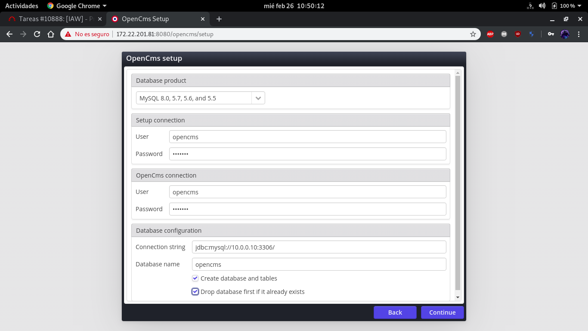
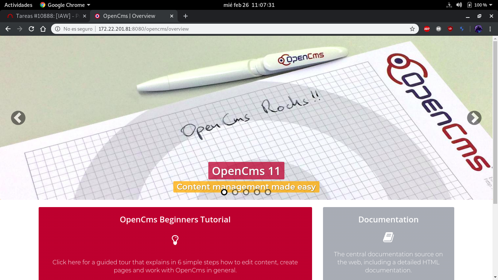
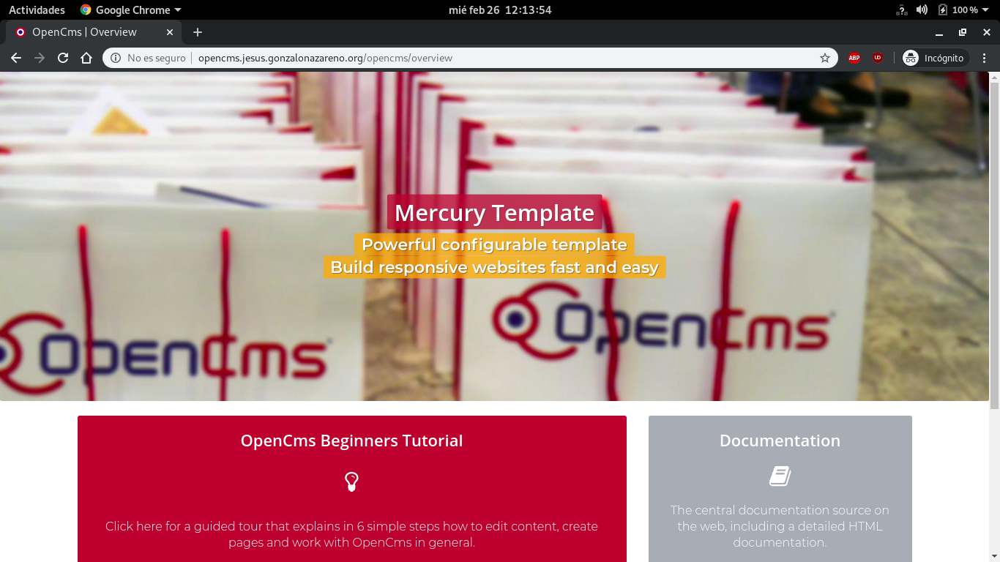

# OpenCMS.
Durante esta práctica, instalaremos `OpenCMS`, un CMS genérico escrito en `java`.

### Paso previos.
Antes de comenzar con la instalación de `OpenCMS`, deberemos instalar los paquetes necesarios para el mismo:
~~~
root@java:~# apt install default-jdk tomcat9 apache2 unzip
~~~

Ya que dispones de un servidor de base de datos (`tortilla`), crearemos una nueva base de datos en el mismo y le daremos permisos:
~~~
MariaDB [(none)]> CREATE DATABASE opencms;
Query OK, 1 row affected (0.04 sec)

MariaDB [(none)]> GRANT ALL ON opencms.* TO opencms@10.0.0.11 IDENTIFIED BY 'opencms';
Query OK, 0 rows affected (0.10 sec)

MariaDB [(none)]> 
~~~

### Instalación.
Con todo listo, pasaremos a descargar, descomprimir y mover el contenido a `/var/lib/tomcat9/webapps/` para servirlo:
~~~
root@java:/tmp# wget http://www.opencms.org/downloads/opencms/opencms-11.0.1.zip
--2020-02-26 09:43:09--  http://www.opencms.org/downloads/opencms/opencms-11.0.1.zip
Resolving www.opencms.org (www.opencms.org)... 81.169.150.111
Connecting to www.opencms.org (www.opencms.org)|81.169.150.111|:80... connected.
HTTP request sent, awaiting response... 200 OK
Length: 211148630 (201M) [application/zip]
Saving to: ‘opencms-11.0.1.zip’

opencms-11.0.1.zip 100%[==============>] 201.37M  8.93MB/s    in 42s     

2020-02-26 09:43:52 (4.80 MB/s) - ‘opencms-11.0.1.zip’ saved [211148630/211148630]

root@java:/tmp# unzip opencms-11.0.1.zip
Archive:  opencms-11.0.1.zip
  inflating: opencms.war             
  inflating: install.html            
  inflating: history.txt             
  inflating: license.txt             
root@java:/tmp# root@java:/tmp# mv opencms.war /var/lib/tomcat9/webapps/
~~~

A continuación, accederemos a la siguiente URL para comenzar la instalación: `http://172.22.201.81:8080/opencms/setup`.

### Configuración Apache2.
Como podemos comprobar, la página la está sirviendo `Tomcat` y no `apache2`, por lo que pasaremos a configurarlo a través del protocolo `ajp` para servir nuestra página:
~~~
#----- Activamos el módulo proxy ajp -----#
root@java:~# a2enmod proxy_ajp
Considering dependency proxy for proxy_ajp:
Module proxy already enabled
Enabling module proxy_ajp.
To activate the new configuration, you need to run:
  systemctl restart apache2
root@java:~# 

#----- Configuramos apache (/etc/apache2/sites-enabled/000-default.conf) -----#
<VirtualHost *:80>
        ServerAdmin webmaster@localhost
        ServerName opencms.jesus.gonzalonazareno.org

        ProxyPreserveHost On
        ProxyRequests Off
        <Proxy *>
            Require all granted
        </Proxy>
        ProxyPass / ajp://172.22.201.81:8009/
        ProxyPassReverse / ajp://172.22.201.81:8009/

        ErrorLog ${APACHE_LOG_DIR}/error.log
        CustomLog ${APACHE_LOG_DIR}/access.log combined
</VirtualHost>

#----- Cambiamos la configuración de tomcat (/var/lib/tomcat9/conf/server.xml) -----#
# Descomentamos la siguiente línea:	
<Connector port="8009" protocol="AJP/1.3" redirectPort="8443" />

#----- Reiniciamos los servicios -----#
root@java:~# systemctl restart tomcat9 apache2
~~~

Una vez configurado, comprobamos el funcionamiento:
