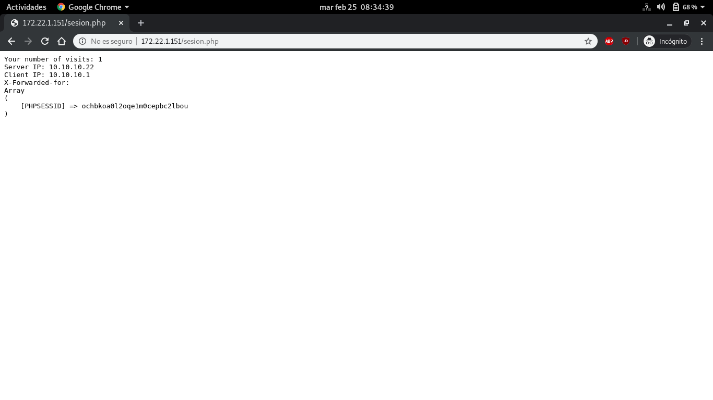

# Balanceador.
Durante esta práctica utilizaremos la herramienta `haproxy` y realizaremos distintas configuraciones.
Adicionalmente utilizaremos un [escenario Vagrant](Vagrantfile) con las siguientes máquinas:
- `balanceador`: Balanceador de carga, direccioón IP: 10.10.10.1.
- `apache1`: Servidor web 1, dirección IP: 10.10.10.11.
- `apache2`: Servidor web 2, dirección IP: 10.10.10.22.

### Instalación y configuración de haproxy.
Instalamos `haproxy` en la máquina `balanceador`:
~~~
root@balanceador:~# apt install haproxy
~~~

Una vez instalado pasamos a configurarlo (`/etc/haproxy/haproxy.cfg`):
~~~
#################
# Configuración #
#################
global
    daemon
    maxconn 256
    user    haproxy
    group   haproxy
    log     127.0.0.1       local0
    log     127.0.0.1       local1  notice     
defaults
    mode    http
    log     global
    timeout connect 5000ms
    timeout client  50000ms
    timeout server  50000ms        
listen granja_cda 
    # Dirección externa del balanceador.
    bind 172.22.1.151:80
    mode http
    # Activación de las estadísticas.
    stats enable
    # Credenciales de la página de estadísticas.
    stats auth  cda:cda
    # Tipo de balanceo.
    balance roundrobin
    # Lista de servidores a balancear.
    server uno 10.10.10.11:80 maxconn 128 check port 80
    server dos 10.10.10.22:80 maxconn 128 check port 80

#---- Habilitamos el servicio en el inicio y reiniciamos -----#
root@balanceador:~# systemctl enable haproxy
Synchronizing state of haproxy.service with SysV service script with /lib/systemd/systemd-sysv-install.
Executing: /lib/systemd/systemd-sysv-install enable haproxy
root@balanceador:~# systemctl restart haproxy
~~~

### Pruebas de funcionamiento

Comprobamos el funcionamiento del balanceo:

Comprobación de la página de estadísticas de `haproxy`:

Ya que anteriormente hemos indicado la opción `check port 80`, cuando apagamos uno de los servidores la página de estadísticas nos lo muestra:

Comprobamos el log de uno de los servidores web (En este caso `apache1`):
~~~
root@apache1:~# cat /var/log/apache2/access.log
10.10.10.1 - - [19/Feb/2020:08:49:57 +0000] "GET / HTTP/1.1" 200 436 "-" "Mozilla/5.0 (X11; Linux x86_64) AppleWebKit/537.36 (KHTML, like Gecko) Chrome/80.0.3987.87 Safari/537.36"
10.10.10.1 - - [19/Feb/2020:08:50:04 +0000] "GET / HTTP/1.1" 200 436 "-" "Mozilla/5.0 (X11; Linux x86_64) AppleWebKit/537.36 (KHTML, like Gecko) Chrome/80.0.3987.87 Safari/537.36"
10.10.10.1 - - [19/Feb/2020:08:51:03 +0000] "GET / HTTP/1.1" 200 436 "-" "Mozilla/5.0 (X11; Linux x86_64) AppleWebKit/537.36 (KHTML, like Gecko) Chrome/80.0.3987.87 Safari/537.36"
10.10.10.1 - - [19/Feb/2020:08:51:06 +0000] "GET /favicon.ico HTTP/1.1" 404 435 "http://172.22.1.151/" "Mozilla/5.0 (X11; Linux x86_64) AppleWebKit/537.36 (KHTML, like Gecko) Chrome/80.0.3987.87 Safari/537.36"
root@apache1:~#
~~~
Como podemos comprobar la dirección que realiza la petición es la dirección interna del balanceador ya que es el balanceador el que se encarga de hacer la paticiones a los distintos servidores de acuerdo al tipo de balanceo que hayamos especificado anteriormente, en nuestro caso `roundrobin`.

### Sticky Sessions.
Para activar la persistencia de conexiones (`sticky cookies`) en `haproxy` añadiremos la siguiente configuración (`/etc/haproxy/haproxy.cfg`):
~~~
# Indica la cookie que queremos que sea persistente.
# En este caso "PHPSESSID" que es la que guarda la sesión en PHP.
cookie PHPSESSID prefix
# Definición de los servidores.
server uno 10.10.10.11:80 cookie servidoruno maxconn 128
server dos 10.10.10.22:80 cookie servidordos maxconn 128

#----- Reiniciamos el servicio -----#
root@balanceador:~# systemctl restart haproxy
~~~

Para comprobar el funcionamiento accederemos a la dirección `172.22.1.151/sesion.php` y comprobaremos como, al recargar la página, el número de visitas aumenta:

A continuación, utilizaremos una ventana de incógnito y comprobaremos que efectivamente, las cookies no se han guardado volviendo el contador a cero:

Por última, miraremos las cabeceras y comprobaremos que la cookie va en la petición:
