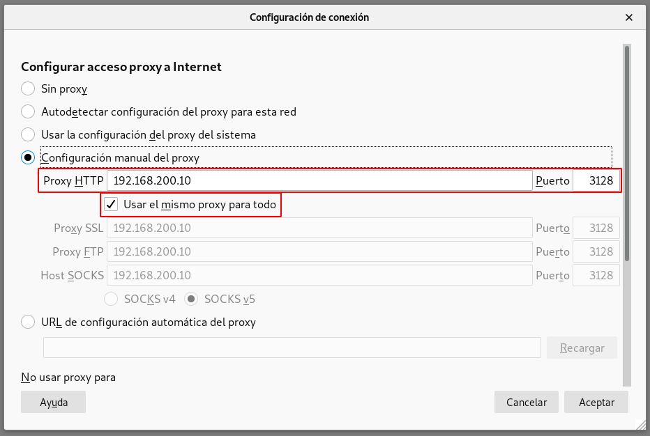
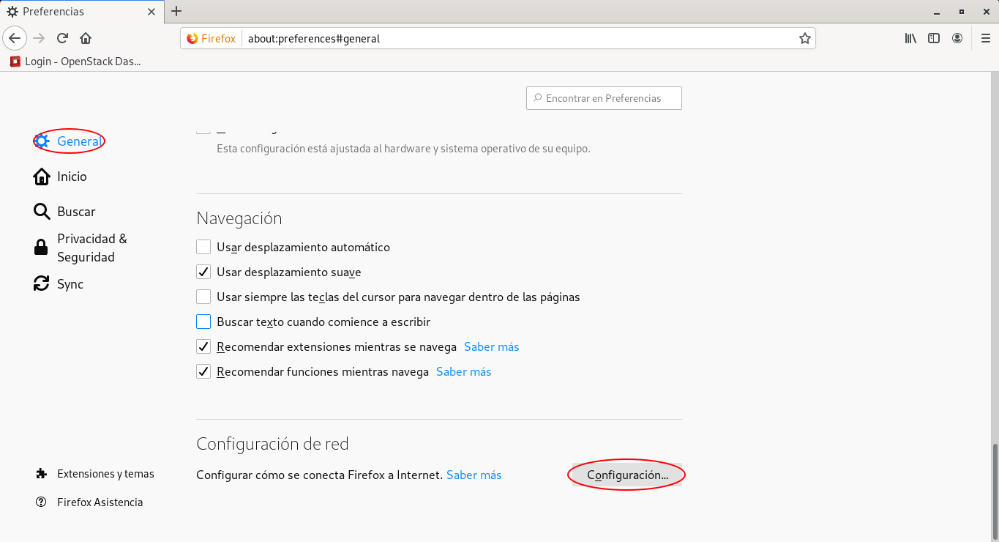
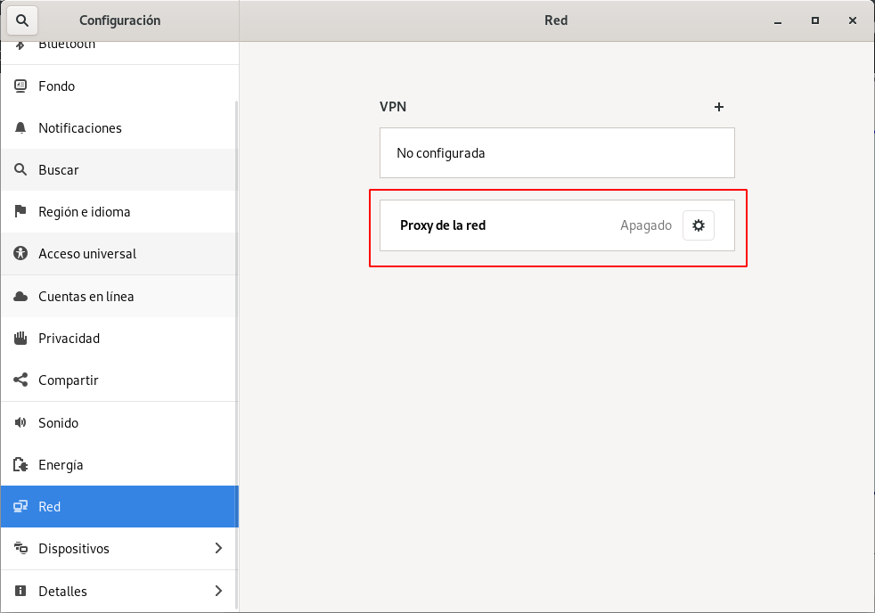
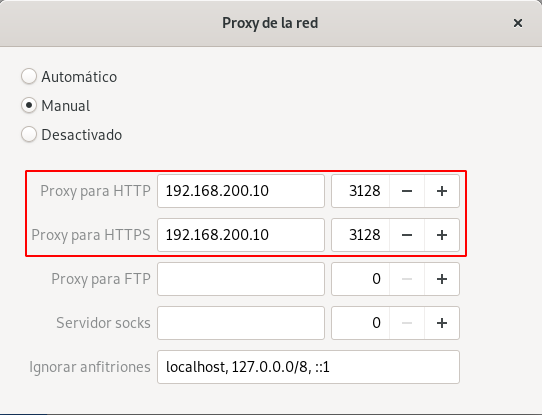

# Proxy.
Durante esta práctica utilizaremos la herramienta `squid` y realizaremos distintas configuraciones.
Adicionalmente utilizaremos un escenario [Vagrant](Vagrantfile) con las siguientes máquinas:
- `proxy`: Servidor proxy, direccioón IP: 10.0.0.10.
- `cliente_int`: Cliente, dirección IP: 10.0.0.11.

### Permitir conexiones desde la red externa.
Instalación de `squid` en la máquina `proxy`:
~~~
root@proxy:~# apt install squid
~~~

Creamos una ACL en `squid` para permitir el acceso de la red externa (`/etc/squid/squid.conf`):
~~~
#################
# Configuración #
#################

# Permitir conexiones desde la red externa.
## Definición de la ACL.
acl externa src 192.168.200.0/24
## Permisos.
http_access allow externa

#----- Reiniciamos el servicio -----#
root@proxy:~# systemctl restart squid
~~~

Una vez instalado y configurado `squid` pasaremos a configurar el cliente, para ello deberemos configurar la navegación a través de proxy en el navegador o bien configurando el proxy del sistema.
Configuración del navegador (`Firefox ESR`):

Configuración del proxy del sistema:

Comprobamos el funcionamiento del proxy desde el servidor (`/var/log/squid/access.log`):
~~~
root@proxy:~# cat /var/log/squid/access.log
...
1582016840.050    181 192.168.200.1 TCP_TUNNEL/200 5447 CONNECT upload.wikimedia.org:443 - HIER_DIRECT/91.198.174.208 -
1582016840.057    223 192.168.200.1 TCP_TUNNEL/200 5662 CONNECT upload.wikimedia.org:443 - HIER_DIRECT/91.198.174.208 -
1582016840.072    238 192.168.200.1 TCP_TUNNEL/200 19658 CONNECT upload.wikimedia.org:443 - HIER_DIRECT/91.198.174.208 -
1582016840.076    242 192.168.200.1 TCP_TUNNEL/200 14466 CONNECT upload.wikimedia.org:443 - HIER_DIRECT/91.198.174.208 -
1582016840.173    339 192.168.200.1 TCP_TUNNEL/200 57231 CONNECT upload.wikimedia.org:443 - HIER_DIRECT/91.198.174.208 -
1582016840.702    158 192.168.200.1 TCP_MISS/200 1038 POST http://ocsp.pki.goog/gts1o1 - HIER_DIRECT/172.217.17.3 application/ocsp-response
1582016841.538    245 192.168.200.1 TCP_TUNNEL/200 15250 CONNECT meta.wikimedia.org:443 - HIER_DIRECT/91.198.174.192 -
~~~

### Permitir conexiones desde la red interna.
Añadimos una nueva ACL en `squid` para permitir el acceso a la red interna (`/etc/squid/squid.conf`):
~~~
# Permitir conexiones desde la red interna.
## Definición de la ACL.
acl interna src 10.0.0.0/24
## Permisos.
http_access allow interna
~~~

Configuramos el proxy en el cliente a través de variables de entorno:
~~~
root@buster:~# export http_proxy="http://10.0.0.10:3128"
root@buster:~# export https_proxy="https://10.0.0.10:3128"
~~~

Comprobamos el funcionamiento del proxy desde el servidor (`/var/log/squid/access.log`):
~~~
root@proxy:~# cat /var/log/squid/access.log
...
1582097900.980     77 10.0.0.11 TCP_MISS/301 857 GET http://google.es/ - HIER_DIRECT/172.217.168.163 text/html
1582097903.213    223 10.0.0.11 TCP_MISS/200 3359 GET http://www.google.es/ - HIER_DIRECT/172.217.17.3 text/html
~~~