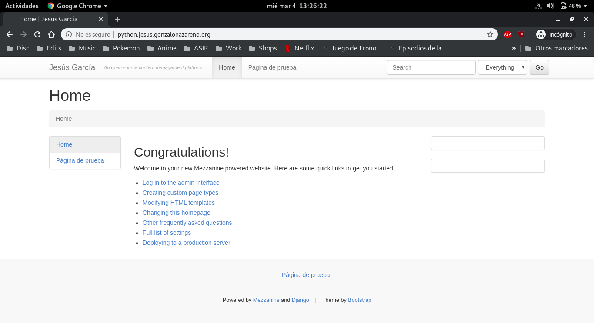

### Entorno de desarrollo.
- Creación del entorno virtual:
~~~
jesus@jesus:~/VirtualEnvs$ python3 -m venv Mezzanine
~~~

- Instalación de `Mezzanine`:
~~~
(Mezzanine) jesus@jesus:~/VirtualEnvs/Mezzanine$ pip install mezzanine
...
(Mezzanine) jesus@jesus:~/VirtualEnvs/Mezzanine$ pip freeze
beautifulsoup4==4.8.1
bleach==3.1.0
certifi==2019.11.28
chardet==3.0.4
Django==1.11.26
django-contrib-comments==1.9.2
filebrowser-safe==0.5.0
future==0.18.2
grappelli-safe==0.5.2
idna==2.8
Mezzanine==4.3.1
oauthlib==3.1.0
Pillow==6.2.1
pkg-resources==0.0.0
pytz==2019.3
requests==2.22.0
requests-oauthlib==1.3.0
six==1.13.0
soupsieve==1.9.5
tzlocal==2.0.0
urllib3==1.25.7
webencodings==0.5.1
(Mezzanine) jesus@jesus:~/VirtualEnvs/Mezzanine$
~~~

- Creación del fichero `requirements.txt`:
~~~
(Mezzanine) jesus@jesus:~/VirtualEnvs/Mezzanine$ pip freeze > requirements.txt
(Mezzanine) jesus@jesus:~/VirtualEnvs/Mezzanine$ cat requirements.txt
beautifulsoup4==4.8.1
bleach==3.1.0
certifi==2019.11.28
chardet==3.0.4
Django==1.11.26
django-contrib-comments==1.9.2
filebrowser-safe==0.5.0
future==0.18.2
grappelli-safe==0.5.2
idna==2.8
Mezzanine==4.3.1
oauthlib==3.1.0
Pillow==6.2.1
pkg-resources==0.0.0
pytz==2019.3
requests==2.22.0
requests-oauthlib==1.3.0
six==1.13.0
soupsieve==1.9.5
tzlocal==2.0.0
urllib3==1.25.7
webencodings==0.5.1
(Mezzanine) jesus@jesus:~/VirtualEnvs/Mezzanine$ 
~~~

- Creación del proyecto:
~~~
(Mezzanine) jesus@jesus:~/VirtualEnvs/Mezzanine$ mezzanine-project tarea8
(Mezzanine) jesus@jesus:~/VirtualEnvs/Mezzanine$ ls
bin  include  lib  lib64  pyvenv.cfg  requirements.txt  share  tarea8
(Mezzanine) jesus@jesus:~/VirtualEnvs/Mezzanine$ 
~~~

- Creación de la base de datos:
~~~
(Mezzanine) jesus@jesus:~/VirtualEnvs/Mezzanine/tarea8$ python manage.py createdb
Operations to perform:
  Apply all migrations: admin, auth, blog, conf, contenttypes, core, django_comments, forms, galleries, generic, pages, redirects, sessions, sites, twitter
Running migrations:
  Applying contenttypes.0001_initial... OK
  Applying auth.0001_initial... OK
  Applying admin.0001_initial... OK
  Applying admin.0002_logentry_remove_auto_add... OK
  Applying contenttypes.0002_remove_content_type_name... OK
  Applying auth.0002_alter_permission_name_max_length... OK
  Applying auth.0003_alter_user_email_max_length... OK
  Applying auth.0004_alter_user_username_opts... OK
  Applying auth.0005_alter_user_last_login_null... OK
  Applying auth.0006_require_contenttypes_0002... OK
  Applying auth.0007_alter_validators_add_error_messages... OK
  Applying auth.0008_alter_user_username_max_length... OK
  Applying sites.0001_initial... OK
  Applying blog.0001_initial... OK
  Applying blog.0002_auto_20150527_1555... OK
  Applying blog.0003_auto_20170411_0504... OK
  Applying conf.0001_initial... OK
  Applying core.0001_initial... OK
  Applying core.0002_auto_20150414_2140... OK
  Applying django_comments.0001_initial... OK
  Applying django_comments.0002_update_user_email_field_length... OK
  Applying django_comments.0003_add_submit_date_index... OK
  Applying pages.0001_initial... OK
  Applying forms.0001_initial... OK
  Applying forms.0002_auto_20141227_0224... OK
  Applying forms.0003_emailfield... OK
  Applying forms.0004_auto_20150517_0510... OK
  Applying forms.0005_auto_20151026_1600... OK
  Applying forms.0006_auto_20170425_2225... OK
  Applying galleries.0001_initial... OK
  Applying galleries.0002_auto_20141227_0224... OK
  Applying generic.0001_initial... OK
  Applying generic.0002_auto_20141227_0224... OK
  Applying generic.0003_auto_20170411_0504... OK
  Applying pages.0002_auto_20141227_0224... OK
  Applying pages.0003_auto_20150527_1555... OK
  Applying pages.0004_auto_20170411_0504... OK
  Applying redirects.0001_initial... OK
  Applying sessions.0001_initial... OK
  Applying sites.0002_alter_domain_unique... OK
  Applying twitter.0001_initial... OK

A site record is required.
Please enter the domain and optional port in the format 'domain:port'.
For example 'localhost:8000' or 'www.example.com'. 
Hit enter to use the default (127.0.0.1:8000): 

Creating default site record: 127.0.0.1:8000 ...

Creating default account ...

Username (leave blank to use 'jesus'): 
Email address: jesus.garcia.inf@gmail.com
Password: 
Password (again): 
Superuser created successfully.
...
(Mezzanine) jesus@jesus:~/VirtualEnvs/Mezzanine/tarea8$ 
~~~

- Inicio del servidor web:
~~~
(Mezzanine) jesus@jesus:~/VirtualEnvs/Mezzanine/tarea8$ python manage.py runserver
              .....
          _d^^^^^^^^^b_
       .d''           ``b.
     .p'                `q.
    .d'                   `b.
   .d'                     `b.   * Mezzanine 4.3.1
   ::                       ::   * Django 1.11.26
  ::    M E Z Z A N I N E    ::  * Python 3.7.3
   ::                       ::   * SQLite 3.27.2
   `p.                     .q'   * Linux 4.19.0-6-amd64
    `p.                   .q'
     `b.                 .d'
       `q..          ..p'
          ^q........p^
              ''''

Performing system checks...

System check identified no issues (0 silenced).
December 11, 2019 - 10:02:14
Django version 1.11.26, using settings 'tarea8.settings'
Starting development server at http://127.0.0.1:8000/
Quit the server with CONTROL-C.
~~~

- Exportación de la base de datos:
~~~
(Mezzanine) jesus@jesus:~/VirtualEnvs/Mezzanine/tarea8$ python manage.py dumpdata > data.json
(Mezzanine) jesus@jesus:~/VirtualEnvs/Mezzanine/tarea8$ ls
data.json  deploy  dev.db  fabfile.py  manage.py  requirements.txt  static  tarea8
(Mezzanine) jesus@jesus:~/VirtualEnvs/Mezzanine/tarea8$ 
~~~

- Subida de los cambios al repositorio de `GitHub`:
~~~
jesus@jesus:~/Documentos/GitHub/Tarea8$ ls
data.json  deploy  dev.db  fabfile.py  manage.py  requirements.txt  static  tarea8
jesus@jesus:~/Documentos/GitHub/Tarea8$ git add .
jesus@jesus:~/Documentos/GitHub/Tarea8$ git commit -am "Desarrollo"
[master (commit-raíz) 44fb124] Desarrollo
 22 files changed, 1356 insertions(+)
 create mode 100644 data.json
 create mode 100644 deploy/crontab.template
 create mode 100644 deploy/gunicorn.conf.py.template
 create mode 100644 deploy/local_settings.py.template
 create mode 100644 deploy/nginx.conf.template
 create mode 100644 deploy/supervisor.conf.template
 create mode 100644 dev.db
 create mode 100644 fabfile.py
 create mode 100644 manage.py
 create mode 100644 requirements.txt
 create mode 100644 static/media/uploads/.thumbnails/otter2.jpg/otter2-543x531.jpg
 create mode 100644 static/media/uploads/.thumbnails/otter2.jpg/otter2-60x60.jpg
 create mode 100644 static/media/uploads/.thumbnails/otter2.jpg/otter2-750x734.jpg
 create mode 100644 static/media/uploads/otter2.jpg
 create mode 100644 tarea8/__init__.py
 create mode 100644 tarea8/__pycache__/__init__.cpython-37.pyc
 create mode 100644 tarea8/__pycache__/settings.cpython-37.pyc
 create mode 100644 tarea8/__pycache__/urls.cpython-37.pyc
 create mode 100644 tarea8/local_settings.py
 create mode 100644 tarea8/settings.py
 create mode 100644 tarea8/urls.py
 create mode 100644 tarea8/wsgi.py
jesus@jesus:~/Documentos/GitHub/Tarea8$ git push
Enumerando objetos: 32, listo.
Contando objetos: 100% (32/32), listo.
Compresión delta usando hasta 8 hilos
Comprimiendo objetos: 100% (28/28), listo.
Escribiendo objetos: 100% (32/32), 346.81 KiB | 1.01 MiB/s, listo.
Total 32 (delta 0), reusado 0 (delta 0)
To github.com:Jesus-Garcia-M/Tarea8.git
 * [new branch]      master -> master
jesus@jesus:~/Documentos/GitHub/Tarea8$ 
~~~

### Entorno de producción.
- Creación de la nueva entrada DNS en `croqueta`:
~~~
python      IN    CNAME    salmorejo
~~~

- Creación de la base de datos en `tortilla`:
~~~
MariaDB [(none)]> CREATE DATABASE mezzanine;
Query OK, 1 row affected (0.00 sec)

MariaDB [(none)]> GRANT ALL ON mezzanine.* TO mezzanine@salmorejo.jesus.gonzalonazareno.org IDENTIFIED BY 'mezzanine';
Query OK, 0 rows affected (0.04 sec)

MariaDB [(none)]>
~~~

- Creación del entorno virtual:
~~~
[centos@salmorejo tarea8]$ python3 -m venv tarea8
~~~

- Clonación del repositorio:
~~~
[centos@salmorejo tarea8]$ sudo git clone https://github.com/Jesus-Garcia-M/Tarea8.git ./
Clonando en 'mezzanine'...
remote: Enumerating objects: 32, done.
remote: Counting objects: 100% (32/32), done.
remote: Compressing objects: 100% (28/28), done.
remote: Total 32 (delta 0), reused 32 (delta 0), pack-reused 0
Desempaquetando objetos: 100% (32/32), listo.
[centos@salmorejo www]$ ls mezzanine/
data.json  deploy  dev.db  fabfile.py  manage.py  requirements.txt  static  tarea8
[centos@salmorejo tarea8]$
~~~

- Instalación del conector `mysql-connector-python`:
~~~
(entorno) [root@salmorejo tarea8]# pip3 install mysql-connector-python
~~~

- Instalación del fichero `requirements.txt`:
~~~
(entorno) [root@salmorejo tarea8]# pip3 install -r requirements.txt
~~~

- Configuración de la base de datos (`tarea8/settings.py`:
~~~
DATABASES = {
    "default": {
        "ENGINE": "mysql.connector.django",
        "NAME": "mezzanine",
        "USER": "mezzanine",
        "PASSWORD": "mezzanine",
        "HOST": "tortilla",
        "PORT": "3306",
    }
}

#----- Prueba de funcionamiento -----#
(entorno) [centos@salmorejo tarea8]$ mysql -u mezzanine -p mezzanine -h tortilla
Enter password: 
Welcome to the MariaDB monitor.  Commands end with ; or \g.
Your MariaDB connection id is 334
Server version: 10.1.43-MariaDB-0ubuntu0.18.04.1 Ubuntu 18.04

Copyright (c) 2000, 2018, Oracle, MariaDB Corporation Ab and others.

Type 'help;' or '\h' for help. Type '\c' to clear the current input statement.

MariaDB [mezzanine]>
~~~

- Modificación de la variable `ALLOWED_HOSTS` para poder acceder a través del nombre creado anteriormente (`tarea8/settings.py`):
~~~
ALLOWED_HOSTS = ['python.jesus.gonzalonazareno.org']
~~~

- Migración de la base de datos:
~~~
(entorno) [root@salmorejo tarea8]# 
Operations to perform:
  Apply all migrations: admin, auth, blog, conf, contenttypes, core, django_comments, forms, galleries, generic, pages, redirects, sessions, sites, twitter
Running migrations:
  Applying contenttypes.0001_initial... OK
  Applying auth.0001_initial... OK
  Applying admin.0001_initial... OK
  Applying admin.0002_logentry_remove_auto_add... OK
  Applying contenttypes.0002_remove_content_type_name... OK
  Applying auth.0002_alter_permission_name_max_length... OK
  Applying auth.0003_alter_user_email_max_length... OK
  Applying auth.0004_alter_user_username_opts... OK
  Applying auth.0005_alter_user_last_login_null... OK
  Applying auth.0006_require_contenttypes_0002... OK
  Applying auth.0007_alter_validators_add_error_messages... OK
  Applying auth.0008_alter_user_username_max_length... OK
  Applying sites.0001_initial... OK
  Applying blog.0001_initial... OK
  Applying blog.0002_auto_20150527_1555... OK
  Applying blog.0003_auto_20170411_0504... OK
  Applying conf.0001_initial... OK
  Applying core.0001_initial... OK
  Applying core.0002_auto_20150414_2140... OK
  Applying django_comments.0001_initial... OK
  Applying django_comments.0002_update_user_email_field_length... OK
  Applying django_comments.0003_add_submit_date_index... OK
  Applying pages.0001_initial... OK
  Applying forms.0001_initial... OK
  Applying forms.0002_auto_20141227_0224... OK
  Applying forms.0003_emailfield... OK
  Applying forms.0004_auto_20150517_0510... OK
  Applying forms.0005_auto_20151026_1600... OK
  Applying forms.0006_auto_20170425_2225... OK
  Applying galleries.0001_initial... OK
  Applying galleries.0002_auto_20141227_0224... OK
  Applying generic.0001_initial... OK
  Applying generic.0002_auto_20141227_0224... OK
  Applying generic.0003_auto_20170411_0504... OK
  Applying pages.0002_auto_20141227_0224... OK
  Applying pages.0003_auto_20150527_1555... OK
  Applying pages.0004_auto_20170411_0504... OK
  Applying redirects.0001_initial... OK
  Applying sessions.0001_initial... OK
  Applying sites.0002_alter_domain_unique... OK
  Applying twitter.0001_initial... OK
~~~

- Carga de datos:
~~~
(entorno) [root@salmorejo tarea8]# python manage.py loaddata data.json
Installed 154 object(s) from 1 fixture(s)
(entorno) [root@salmorejo tarea8]#
~~~

- Instalación de `gunicorn`:
~~~
(entorno) [root@salmorejo tarea8]# pip install gunicorn
~~~

- Creación del socker para `gunicorn` (`/etc/systemd/system/gunicorn.socket`):
~~~
[Unit]
Description=Socker GUnicorn

[Socket]
ListenStream=127.0.0.1:8080

[Install]
WantedBy=sockets.target
~~~

- Creación de la unidad systemd para `gunicorn` (`/etc/systemd/system/gunicorn.service`):
~~~
[Unit]
Description=Demonio GUnicorn
After=network.target

[Service]
WorkingDirectory=/var/www/tarea8
ExecStart=/bin/bash /var/www/tarea8/gunicorn_start
ExecReload=/bin/bash /var/www/tarea8/gunicorn_start
RemainAfterExit=yes

[Install]
WantedBy=multi-user.target
~~~

- Contenido del scrip (`/var/www/tarea8/gunicorn_start`):
~~~
#!/bin/bash

NAME="tarea8"
DJANGODIR=/var/www/tarea8
USER=nginx
GROUP=nginx
WORKERS=1
BIND=127.0.0.1:8080
DJANGO_SETTINGS_MODULE=tarea8.settings
DJANGO_WSGI_MODULE=tarea8.wsgi
LOGLEVEL=error

cd $DJANGODIR
source /var/www/tarea8/entorno/bin/activate

export DJANGO_SETTINGS_MODULE=$DJANGO_SETTINGS_MODULE
export PYTHONPATH=$DJANGODIR:$PYTHONPATH

exec /var/www/tarea8/entorno/bin/gunicorn ${DJANGO_WSGI_MODULE}:application \
  --name $NAME \
  --workers $WORKERS \
  --user=$USER \
  --group=$GROUP \
  --bind=$BIND \
  --log-level=$LOGLEVEL \
  --log-file=-
~~~

- Iniciamos `gunicorn`:
~~~
(entorno) [root@salmorejo ~]# systemctl start gunicorn
(entorno) [root@salmorejo ~]# systemctl status gunicorn
● gunicorn.service - Demonio GUnicorn
   Loaded: loaded (/etc/systemd/system/gunicorn.service; disabled; vendor preset: disabled)
   Active: active (running) since Wed 2020-03-04 11:38:55 UTC; 17min ago
 Main PID: 1912 (gunicorn)
    Tasks: 2 (limit: 4946)
   Memory: 47.8M
   CGroup: /system.slice/gunicorn.service
           ├─1912 /var/www/tarea8/entorno/bin/python3 /var/www/tarea8/entorno/bin/gunicorn tarea8.wsgi:application --name tarea8 --workers 1 --user=>
           └─1915 /var/www/tarea8/entorno/bin/python3 /var/www/tarea8/entorno/bin/gunicorn tarea8.wsgi:application --name tarea8 --workers 1 --user=>

Mar 04 11:38:55 salmorejo.jesus.gonzalonazareno.org systemd[1]: Started Demonio GUnicorn.
lines 1-11/11 (END)
~~~

- Por último creamos el virtualhost en `nginx` (`/etc/nginx/conf.d/mezzanine.conf`):
~~~
server {
        listen 80;
        server_name python.jesus.gonzalonazareno.org;
        root /var/www/tarea8;
    location / {
      proxy_set_header X-Forwarded-For $proxy_add_x_forwarded_for;
      proxy_set_header X-Forwarded-Proto $scheme;
      proxy_set_header Host $http_host;
      proxy_redirect off;
      proxy_pass http://127.0.0.1:8080;
    }
    location /static {
        alias /var/www/tarea8/static;
    }
}
~~~

- Comprobamos el funcionamiento:
